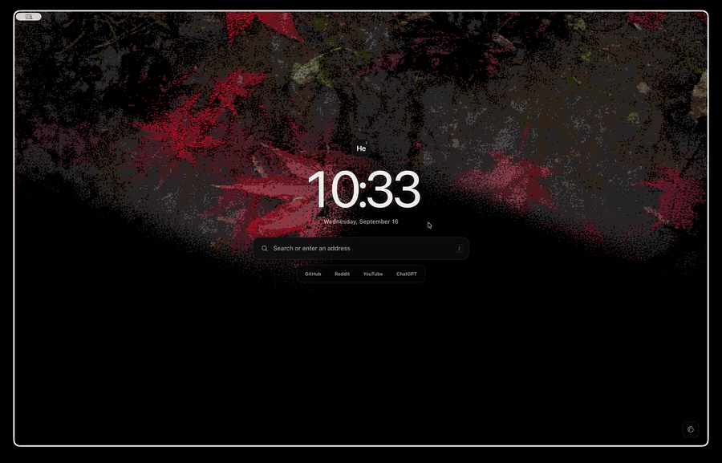

# A more atmospheric new tab for Helium

Turn every new tab into a quiet, animated dashboard. Pick any photo and this
page gives it a dark, shifting dither effect inspired by Aura—while keeping the
clock, search, and your favorite sites close at hand.



## What you get

- A subtle animated wallpaper that fades cleanly into black
- A clock, date, search box, and quick links
- A built-in image picker—no code required
- Private, local customization: your selected image stays in your browser
- Smooth, battery-conscious animation that pauses when the tab is hidden
- No installation scripts, accounts, dependencies, or build step

## Install it in Helium

1. Download this repository from **Code → Download ZIP**, then extract it
   somewhere you plan to keep it. Cloning the repository works too.
2. In Helium, open `helium://flags/#custom-ntp`.
3. Enable **Custom New Tab Page**.
4. Set its value to the full file URL for this project's `index.html`.

   On macOS, it will look something like:

   ```text
   file:///Users/you/Hacks/custom-helium-start/index.html
   ```

5. Open `helium://settings/onStartup` and choose **Open the New Tab page**.
6. Open a new tab and enjoy.

## Make it yours

Click the palette button in the lower-right corner to choose a wallpaper. The
page resizes and saves it locally, so nothing is uploaded. You can return to a
plain dark background at any time.

Want different quick links? Edit the links in `index.html`. The search box uses
Google by default; change `SEARCH_URL` in `app.js` to use another search engine.

## Privacy

The page makes no background network requests. It only connects to the internet
when you submit a search or open one of the shortcut links.

## About this project

This is an unofficial fork of
[`mlemlabs/custom-helium-start`](https://github.com/mlemlabs/custom-helium-start),
rebuilt around a lightweight WebGL2 dither effect. It is not affiliated with
Helium or Imput.

The original start page is MIT-licensed. The animated photo treatment is based
on Aura and Paper Shaders. See [`THIRD_PARTY_NOTICES.md`](THIRD_PARTY_NOTICES.md)
and `licenses/` for complete provenance and license texts.
